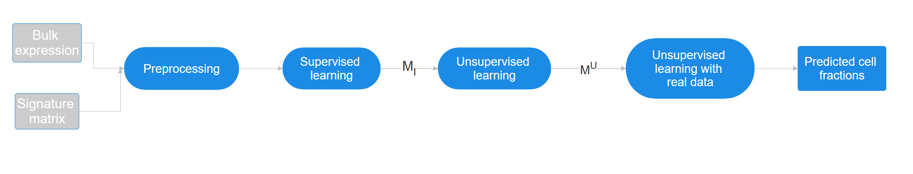

# DECODE

## Deconvolution of Bulk Gene Expression Data into Cell Fractions
### Abstract
It is becoming clear that bulk gene expression measurements represent an average over very different
cells. Elucidating the expression and abundance of each of the encompassed cells is key to disease
understanding and precision medicine approaches. A first step in any such deconvolution is the
inference of cell type abundances in the given mixture. Here we present DECODE, a deep learning
method for the task that builds on a deep unfolded non-negative matrix factorization technique. We
show that our method outperforms previous approaches on a range of synthetic and real data sets.

### This repository

This repository contains Python code for deconvolution of bulk gene expression data into estimates of cell fractions using DECODE.


A sketch of the DECODE pipeline. From left to right: DECODE receives a bulk
expression matrix and a signature of expression profiles. It first applies supervised training on
training data that are synthetically generated using realistic cell fractions for I iterations. The
resulting model is trained in an unsupervised fashion for another I iterations and yields $M^U$. This
model is then trained on the real data to produce the final model.


## Dependencies
DECODE was developed and tested on python 3.10. It was not tested on lower versions of python, but should also be usable on python 3.8. DECODE does not require any special hardware (e.g. GPU), however we recommend to run it with GPU.


The code in this repository requires the following Python packages:

- numpy
- pandas
- typing 
- torch
- attrs
- scipy

All of these packages can be installed using pip:

`python3 -m pip install -r requirements.txt`

## Usage
To run the code you need to run the `main` function.

`main` gets 5 parameters:
```
output_folder: str,
ref_folder: str,
mixes_folder: str,
true_prop_folder: str,
output_folder_final: str,
index_dataset: int = 0
```
`output_folder` - in this folder the model saves its temporary models, after learning with simulated data  (can be tmp folder) </br>
`ref_folder` - this folder contains signature matrices </br>
`mixes_folder` - this folder contains the datasets (bulk expressions) </br>
`true_prop_folder` - this folder contains the desired cells of the datasets (for each dataset 'x.tsv' there is a file 'TruePropx.tsv' with one column - the desired cells). we are going to predict these cells</br>
`output_folder_final` - In this folder the model saves the final results </br>
`index_dataset` - The index of the dataset in the `mixes_folder` (the default is to run the DECODE algorithm on the first file) 

For example:</br>
`mkdir output`</br>
`cd DECODE`</br>
`main('output', 'examples/signatures', 'examples/mixes', 'examples/true_proportions', 'output', 0)`</br>

## Example
`pip install -e .` </br>
In ipython run the following command: </br>
`from DECODE.main.main_file import main` </br>
`main('examples/output/', 'examples/signatures', 'examples/mixes', 'examples/true_proportions', 'examples/output', 0)`

(Note that you need to add DECODE path to PYTHONPATH env-var before running)
## Contributing
Contributions to this repository are welcome! If you have any bug reports, feature requests, or other suggestions, please feel free to open an issue or submit a pull request